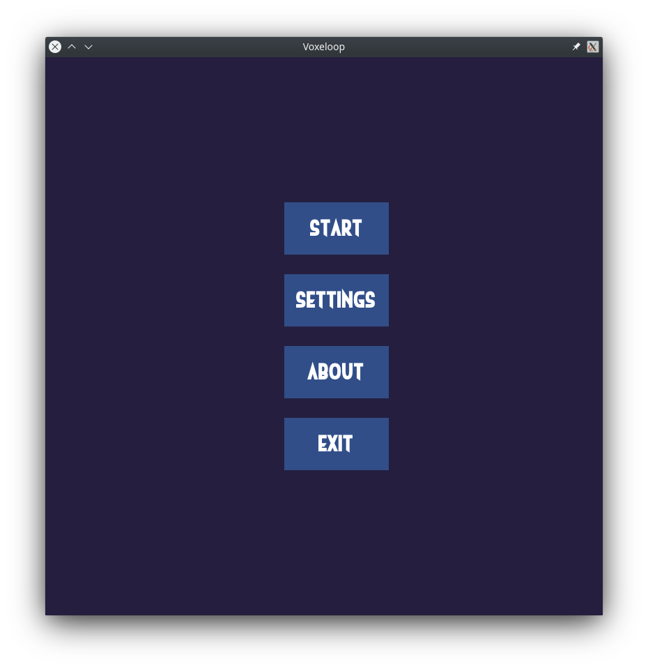
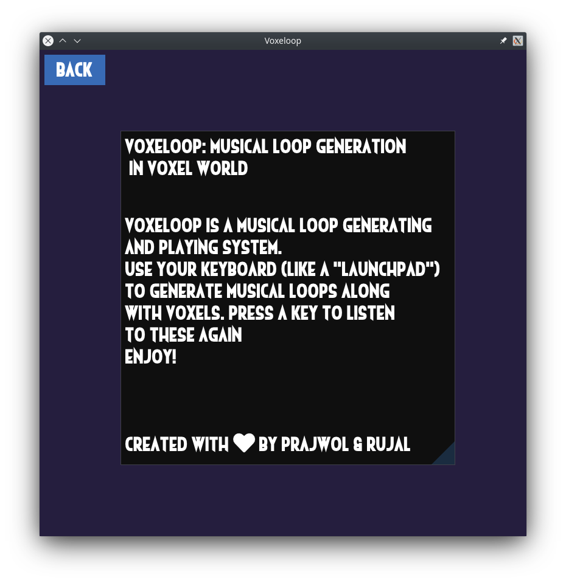
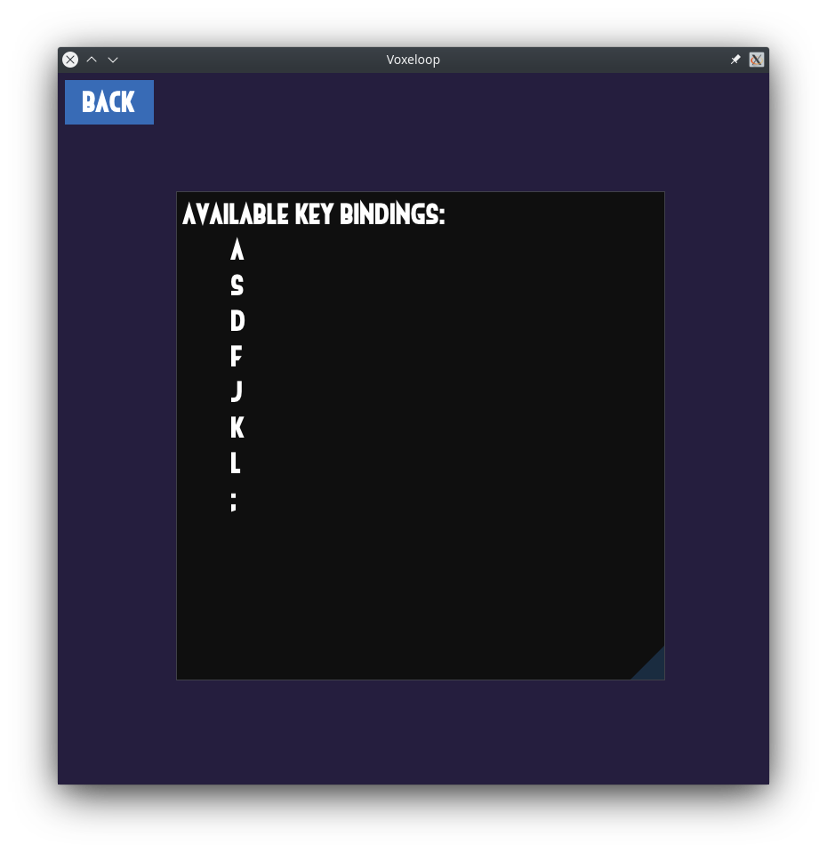
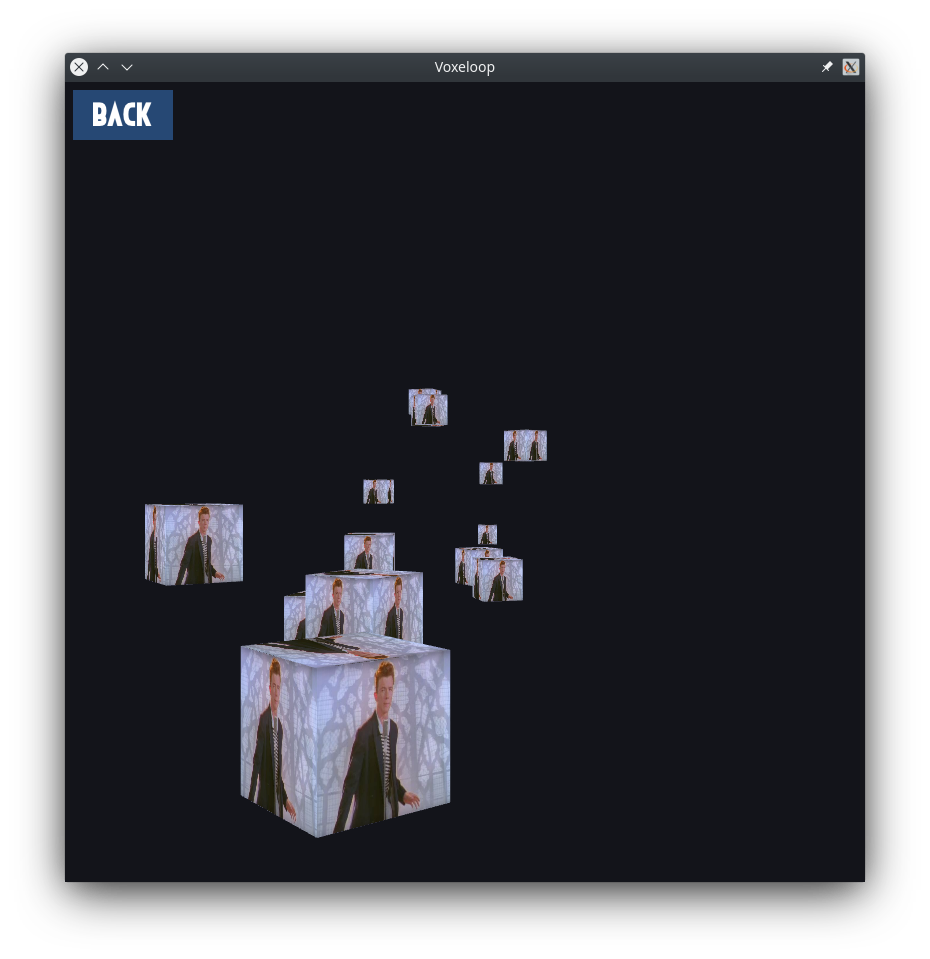

# Voxeloop

### Musical Loop Generation in Voxel World

[](https://github.com/jarp0l/Voxeloop/actions/workflows/docs.yml)

- [Voxeloop](#voxeloop)
    - [Musical Loop Generation in Voxel World](#musical-loop-generation-in-voxel-world)
  - [Documentation](#documentation)
  - [Build](#build)
    - [Build using CMake](#build-using-cmake)
      - [With `ninja`](#with-ninja)
      - [With `make`](#with-make)
  - [Project By](#project-by)
  - [Libraries Used](#libraries-used)
  - [Screenshots of Program](#screenshots-of-program)
    - [Menu Screen](#menu-screen)
    - [About Screen](#about-screen)
    - [Settings Screen](#settings-screen)
    - [Play Screen](#play-screen)
- [Acknowledgements](#acknowledgements)

## Documentation
Online documentation of the project is available at: 
[https://jarp0l.github.io/Voxeloop](https://jarp0l.github.io/Voxeloop)

## Build
### Build using CMake

(*Note: You must be in `build` directory.*)

#### With `ninja`
If you have `ninja` installed:

```sh
    mkdir build
    cd build
    cmake .. -G Ninja
    ninja
    ./voxeloop
```

#### With `make`

```sh
    mkdir build
    cd build
    cmake ..
    make
    ./voxeloop
```

**Note:** Since the project was developed mainly on linux machines, it is not guaranteed that the project will build on first time at Windows. You may need to change the paths of assets used to the relative path. Also since the libraries are built from source, it takes a bit longer time when building for the first time.

## Project By
* Prajwol Pradhan (PUL076BEI023)
* Rujal Acharya (PUL076BEI029)
 
## Libraries Used

* GLFW: [https://glfw.org](https://glfw.org)
* GLAD: [https://github.com/Dav1dde/glad](https://github.com/Dav1dde/glad)
* Dear ImGui: [https://github.com/ocornut/imgui](https://github.com/ocornut/imgui)
* stb: [https://github.com/nothings/stb](https://github.com/nothings/stb)
* miniaudio: [https://miniaud.io](https://miniaud.io)

## Screenshots of Program
### Menu Screen



### About Screen



### Settings Screen



### Play Screen



# Acknowledgements
* Ineptic Font by  Chequered Ink (Non-Commercial use)
* Icon font header file by @juliettef: https://github.com/juliettef/IconFontCppHeaders
* Icon font by FontAwesome: https://fontawesome.com